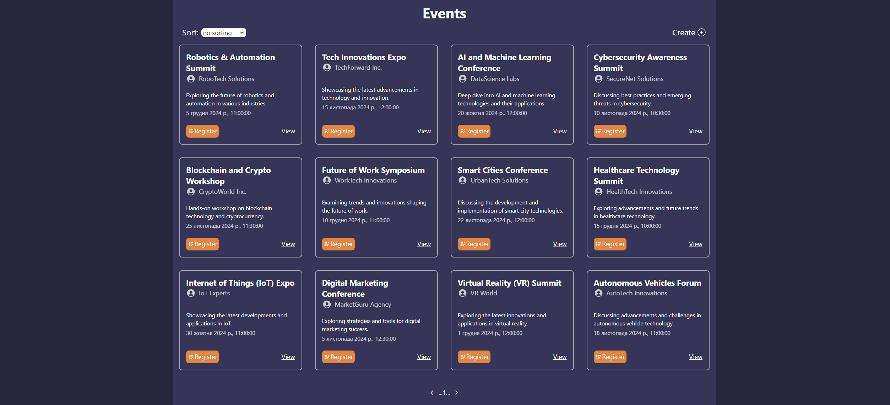
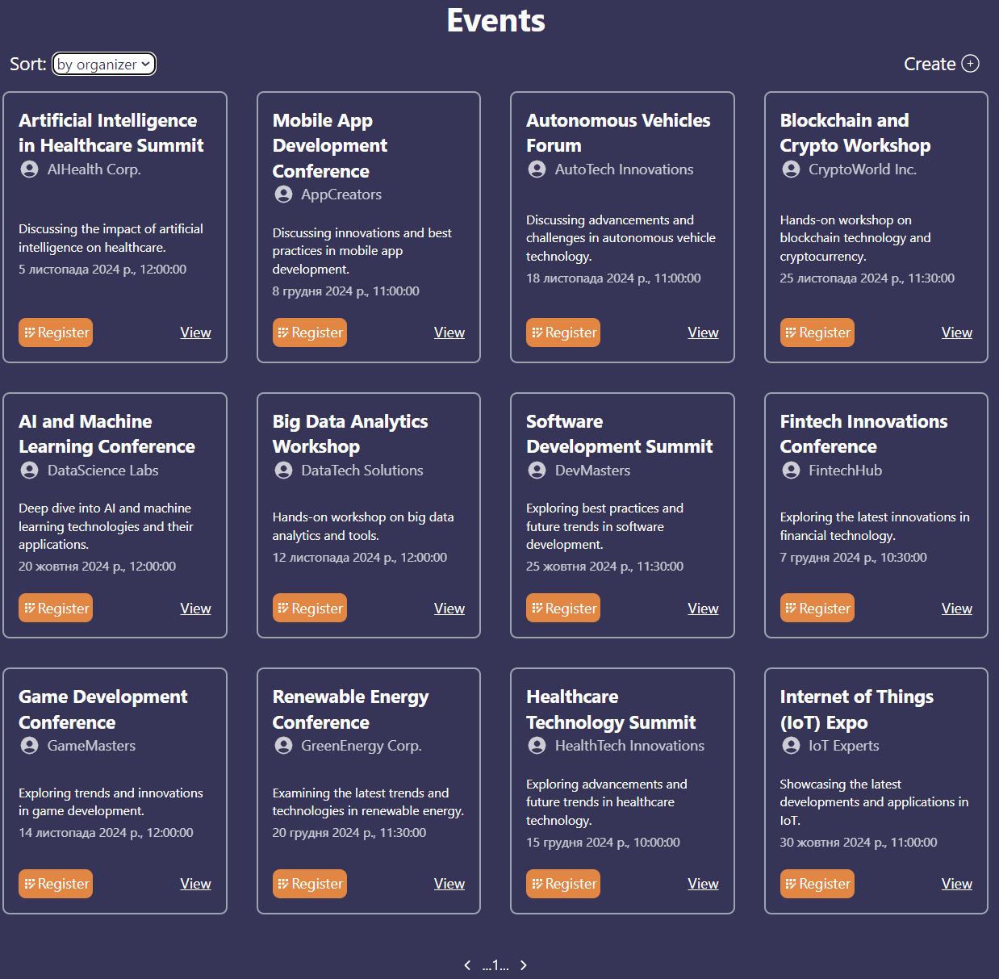

# Events Registration App

## Overview
This is a web-based application for event registration, allowing users to view events, register, and see participants.

## Completed Tasks (including all tasks from the middle level)
- **Base Level**: 
  - Events board page with a paginated list of events.
  - Event registration page with a form for full name, email, date of birth, and source of information.
  - Event participants page displaying registered users.

- **Middle Level**:
  - Added sorting functionality for events by title, date, and organizer.
  - Implemented form validation on the registration page.
  - Integrated a date picker for the Date of Birth input.
  - Added search functionality for participants by full name and email.

- **Additional Feature**:
  - Implemented the ability to create new events.
  - Added GitHub Actions for automated deployment.

## Technology Stack
- **Frontend**: React.js, Tailwind CSS
- **Backend**: Node.js (with Express)
- **Database**: MongoDB with Mongoose library

## Functionality Demonstration
### Events Board Page
#### Desktop View
  

#### Tablet View
  

#### Mobile View
  

### Pagination
#### First page
  
#### Second page
 

### Filtering events
#### by name
 
#### by date
 
#### by organizer
 

### Event Registration Page

#### Desktop View
  

#### Tablet View
  

#### Mobile View
  

### Form Validation

#### Name Validation
- **Requirement**: The name field is mandatory and must be in the format of full name (First Name Last Name).
- **Validation Example**: If the input is invalid, a message will be shown to the user.
  

#### Email Validation
- **Requirement**: The email must match a standard email format and will be validated using a regular expression.
- **Validation Example**: If the email doesn't pass the regex check, a message will prompt the user to enter a valid email.
  

#### Date of Birth Validation
- **Requirement**: The date of birth field uses a date picker. The date must be earlier than the current date to be valid.
- **Validation Example**: Users cannot select a date greater than today.
  

#### "Where did you hear about this event?" Field Validation
- **Requirement**: The user must select an option in the "Where did you hear about this event?" field. It is mandatory.
- **Validation Example**: If left blank, the form will prompt the user to select a valid option.
  

### Example of a Valid User
- **Valid User Example**:
  - **Name**: Vasylkiv John Andriyovych
  - **Email**: john.doe@example.com
  - **Date of Birth**: 1990-05-15
  - **Where did you hear about this event?**: Social Media
  

### Saving Data to the Database
- **Process**: Once the form passes all validations, the data is submitted and saved to the MongoDB database.
- **Data Storage Example**: A successful submission will display a confirmation message, and the user will be registered for the event.
  

### Registration Restrictions
- **Restriction**: If a user is already registered for an event, they will not be able to register again.
- **Error Message Example**: If the user attempts to register again, an error message will be displayed.
  

### Participants Page

#### Desktop View
  

#### Tablet View
  

#### Mobile View
  

### Pagination
- **Description**: The participants list is paginated to improve performance and user experience. The user can navigate between different pages of participants.
  
#### First Page
 

#### Second Page
  

### Search Functionality
- **Description**: The search field allows users to search participants by their full name or email address. The search operates dynamically to display matching participants immediately.

#### Search by Full Name
- **Example**: Searching for "John" will display only participants with this full name.
  

#### Search by Email
- **Example**: Searching for "olya@gmail.com" will display the participant with that email address.

### Create New Event Page

#### Desktop View

#### Tablet View

#### Mobile View

### Event Form Fields:
- **Title** (mandatory): The title of the event is required and must not be empty.  
  

- **Description** (mandatory): A description of the event is required and must not be empty.  
  

- **Event Date and Time** (mandatory, validated): The event date and time are mandatory and must be set to a future date (not earlier than the current time).  
  

- **Organizer** (mandatory): The organizer's name is required and must not be left empty.  
  

### Successful Creation:
- Upon successful validation and submission, the event is saved to the database, and a confirmation message is shown to the user.
  

### Data in Database:
- The event data is stored in MongoDB after submission and can be viewed directly from the database.
  

### View Updated Events Page:
- The newly created event will appear on the events page.
  